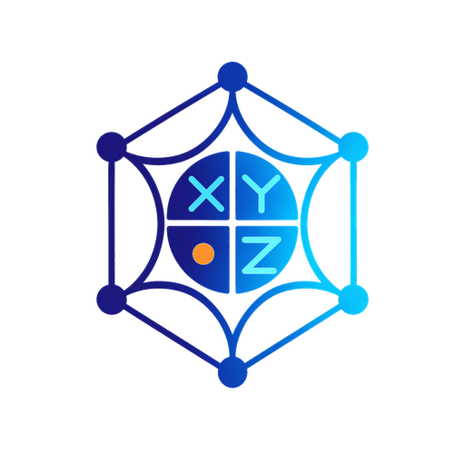

---
hide:
  - navigation
  - toc
---

<div class="tp-hero">
  <div class="tp-hero-copy">
    <p class="tp-kicker">RUST-NATIVE · PYTHON-FIRST · TENSORCIRCUIT</p>
    <h1>Pauli structure,<br><em>made practical.</em></h1>
    <p class="tp-hero-lede">TenCirPauli brings fast Pauli algebra, Hamiltonian plans, symmetry tools, and native observable propagation to the TensorCircuit ecosystem.</p>
    <div class="tp-actions">
      <a class="tp-button tp-button-primary" href="quickstart/">Start with Python</a>
      <a class="tp-button tp-button-secondary" href="api/">Browse the API</a>
    </div>
  </div>
  <div class="tp-hero-mark" aria-label="TenCirPauli logo">
    
    <span>structured<br>quantum work</span>
  </div>
</div>

<div class="tp-note"><strong>One package, two useful paths.</strong> Use native Rust execution for compact CPU workloads, or compile a stable plan for NumPy, TensorCircuit, and JAX.</div>

## A small map of the library

<div class="tp-flow" markdown>
  <div class="tp-flow-item"><span>01</span><strong>Represent</strong><small>Pauli words, operators, and structured algebra.</small></div>
  <div class="tp-flow-arrow">→</div>
  <div class="tp-flow-item"><span>02</span><strong>Compile</strong><small>Dense, sparse, matrix-free, and backend plans.</small></div>
  <div class="tp-flow-arrow">→</div>
  <div class="tp-flow-item"><span>03</span><strong>Analyze</strong><small>Grouping, symmetries, sectors, and mappings.</small></div>
  <div class="tp-flow-arrow">→</div>
  <div class="tp-flow-item"><span>04</span><strong>Execute</strong><small>Propagation, gradients, and TensorCircuit interop.</small></div>
</div>

## What it covers

<div class="tp-card-grid" markdown>
  <div class="tp-card">
    <p class="tp-card-index">01 / ALGEBRA</p>
    <h3>Canonical Pauli operators</h3>
    <p>Products, phases, commutation, deterministic aggregation, and direct Hamiltonian construction.</p>
  </div>
  <div class="tp-card">
    <p class="tp-card-index">02 / PLANS</p>
    <h3>Choose the target</h3>
    <p>Compile to dense, COO, CSR, native matrix-vector products, or a TensorCircuit backend plan.</p>
  </div>
  <div class="tp-card">
    <p class="tp-card-index">03 / STRUCTURE</p>
    <h3>Measure and reduce</h3>
    <p>Group measurements, analyze Z₂ and U(1) structure, map fermions, and work in restricted sectors.</p>
  </div>
  <div class="tp-card">
    <p class="tp-card-index">04 / CIRCUITS</p>
    <h3>Propagate observables</h3>
    <p>Run deterministic or stochastic Pauli propagation with native gradients and familiar Python facades.</p>
  </div>
</div>

## A first result

```python
import tencirpauli as tcp

hamiltonian = tcp.PauliOperator.from_terms(
    2, [("XX", 0.5), ("ZI", -1.25j)]
)

matrix = hamiltonian.dense()
print(matrix.shape)
# (4, 4)
```

The public surface stays in Python; the computationally dense work is handled behind one coarse native boundary. Read the [concepts](concepts.md) page for the mental model, or go straight to the [quickstart](quickstart.md) when you already know what you need.

<div class="tp-footer-links">
  <a href="concepts/">How it fits together</a>
  <a href="quickstart/">Run a small example</a>
  <a href="api/">Find a public symbol</a>
  <a href="https://github.com/tensorcircuit/TenCirPauli">Read the source</a>
</div>
